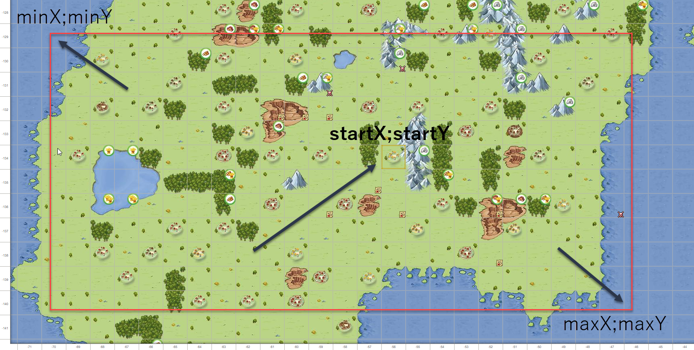
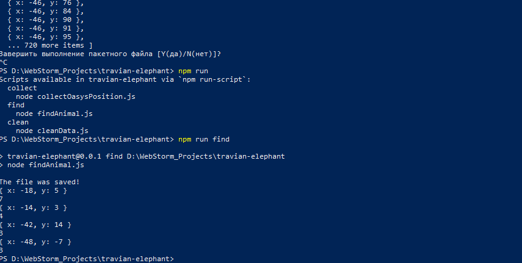

# Travian Elephant Finder

[](https://github.com/tegos/travian-elephant-finder/actions/workflows/ci.yml)
[](LICENSE)
[](package.json)

<br/>

Oases are map tiles guarded by wild animal populations — clearing one gives resource bonuses to a nearby village and hero experience. Elephants are the toughest animal you'll find guarding an oasis, worth the most hero XP, which makes their oases the best target on the map. Scanning hundreds of tiles by hand to find them is slow — this CLI does it for you: it walks a coordinate grid, records every oasis, then reports which ones hold elephants (plus crocodiles, tigers and other animals), sorted by distance from your village.

Tested in **Shadow Empires**, **Fire and Sand** and **Legends (4)**.

<p align="center">
<br/>


</p>

## Table of contents

- [Features](#features)
- [Requirements](#requirements)
- [Quickstart](#quickstart)
- [Setup and configuration](#setup-and-configuration)
- [Usage](#usage)
- [Troubleshooting](#troubleshooting)
- [Development](#development)
- [Technologies](#technologies)
- [Author](#author)
- [License](#license)
- [Disclaimer](#disclaimer)

## Features

- Scans a configurable map area and records every oasis tile
- Detects which oases hold elephants, and reports crocodiles/tigers/other animals too
- Exports results as CSV (raw data) and a sortable HTML report
- Sorts results by distance from your village
- Randomized delay between requests to avoid hammering the server

## Requirements

- Node.js >=22 (see `.nvmrc` — run `nvm use` if you have nvm)
- A Travian account (a fake/throwaway one is recommended, see [Disclaimer](#disclaimer))

## Quickstart

```bash
git clone https://github.com/tegos/travian-elephant-finder.git
cd travian-elephant-finder
npm install
npm run setup          # copies .env / cookie.txt from their .example files
# fill in .env — see Setup and configuration below
npm run collect        # walk the map, record oasis positions
npm run find           # scan recorded oases for elephants, write CSV + HTML report
```

## Setup and configuration

`npm run setup` copies `.env.example` → `.env` and `cookie.txt.example` → `src/config/cookie.txt` if they don't already exist. You then need to fill in `.env`.

> **Ban risk:** this tool logs into your Travian account directly through the game's own login API using the credentials in `.env`, and then automates gameplay. That's against most game servers' terms of service, and submitting real account credentials to a third-party script is an even more direct violation than reusing a copied browser session cookie. Use a throwaway/fake account you're prepared to lose — never your main account. The maintainer is not responsible for banned accounts.

`src/config/cookie.txt` is fully auto-managed — the tool logs in with `TRAVIAN_LOGIN`/`TRAVIAN_PASSWORD` and stores the resulting session cookie there itself (`src/services/auth.js`), refreshing it automatically whenever a request comes back unauthorized. You don't need to touch it.

### Environment variables (`.env`)

| Variable | Meaning |
|---|---|
| `TRAVIAN_SERVER` | Base URL of your game world, e.g. `https://ts8.x1.europe.travian.com` |
| `TRAVIAN_LOGIN` | Your Travian account username (throwaway account recommended — see disclaimer) |
| `TRAVIAN_PASSWORD` | Password for that account |
| `START_X`, `START_Y` | Your village/capital coordinates — used to sort results by distance |
| `MIN_X`, `MIN_Y` | Top-left corner of the map area to scan |
| `MAX_X`, `MAX_Y` | Bottom-right corner of the map area to scan |
| `DELAY_MIN`, `DELAY_MAX` | Random delay range in ms between requests (default 1000–1500), keeps traffic looking human |



## Usage

- `npm run clean` — resets the `output/` data directory
- `npm run collect` — walks the configured map area and records oasis positions. Takes a while — duration depends on your area size and `DELAY_MIN`/`DELAY_MAX`

    

- `npm run find` — scans recorded oases for animals and writes the report

    

Results are saved to `output/`:
- `elephant_*.csv` — raw data
- `elephant_*.html` — sortable report (open in a browser)

| Column | Meaning |
|---|---|
| `x`, `y` | Oasis coordinates |
| `Elephant` | Elephant count guarding the oasis |
| `Another animal` | Count of other animal types present |
| `hasCrocodile`, `hasTiger` | Whether crocodiles/tigers are present |
| `totalAnimal` | Total animal count guarding the oasis |

| x | y | Elephant | Another animal | hasCrocodile | hasTiger | totalAnimal |
| :---: | :---: | :---: | :---: | :---: | :---: | :---: |
| -18 | 5 | 7 | 6 | 1 | 1 | 141 |
| -14 | 3 | 4 | 5 | 0 | 0 | 34 |
| -42 | 14 | 3 | 4 | 0 | 0 | 77 |
| -48 | -7 | 3 | 4 | 0 | 0 | 84 |


## Troubleshooting

- **`collect`/`find` exits with "Missing required configuration"** — an `.env` variable is empty, most likely `TRAVIAN_LOGIN`/`TRAVIAN_PASSWORD`; re-check the [Setup section](#setup-and-configuration).
- **`collect`/`find` exits immediately with "Login failed: ..."** — wrong credentials, or the account is locked/banned; double-check `TRAVIAN_LOGIN`/`TRAVIAN_PASSWORD`.
- **`collect`/`find` stalls or errors mid-run** — the session likely expired; the tool automatically re-authenticates using `TRAVIAN_LOGIN`/`TRAVIAN_PASSWORD` on the next request. If it keeps failing, rerun — both scripts resume from where `output/oasis.json` / `output/oasis-occupied.json` left off.
- **Getting rate-limited or logged out** — raise `DELAY_MIN`/`DELAY_MAX` in `.env`.

## Development

- `npm run lint` — check code style with [Biome](https://biomejs.dev/)
- `npm run lint:fix` — auto-fix what Biome can

## Technologies

- **Node.js** >=22
- **Axios** — HTTP requests
- **Cheerio** — HTML parsing
- **cli-progress** — progress bar
- **dotenv** — environment config
- **Biome** — linting/formatting

## Author

* [**Mykhavko Ivan**](https://github.com/Tegos)

## License

This project is licensed under the MIT License - see the [LICENSE](LICENSE) file for details

## Disclaimer

_This is a research project — use it on your own behalf and at your own risk. The maintainer is not responsible for how it's used or for any consequences, including banned accounts._

---

<p align="center">
  <a href="https://savelife.in.ua/en/donate-en/" target="_blank">
    
  </a>
</p>
