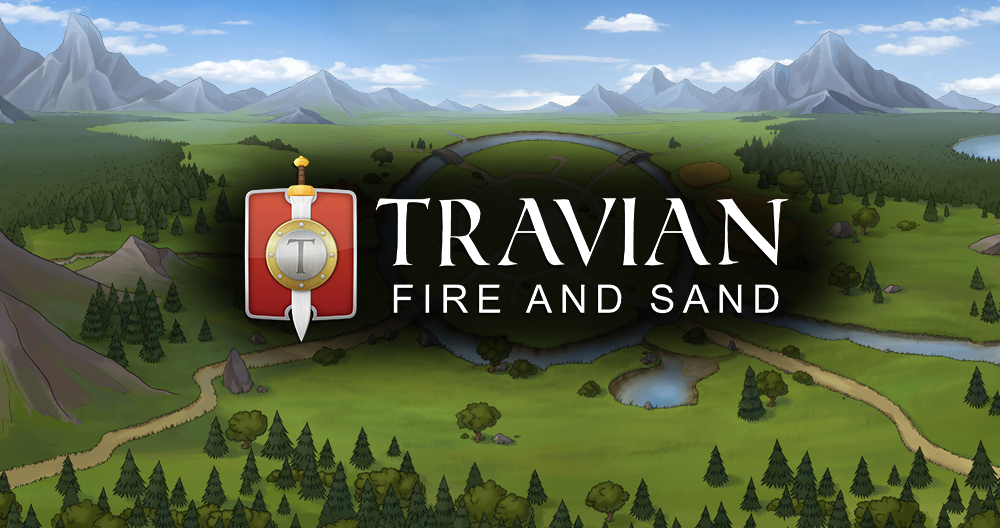
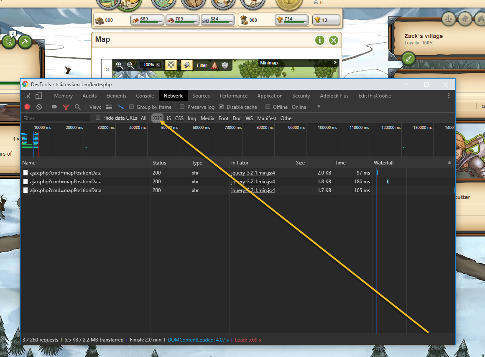
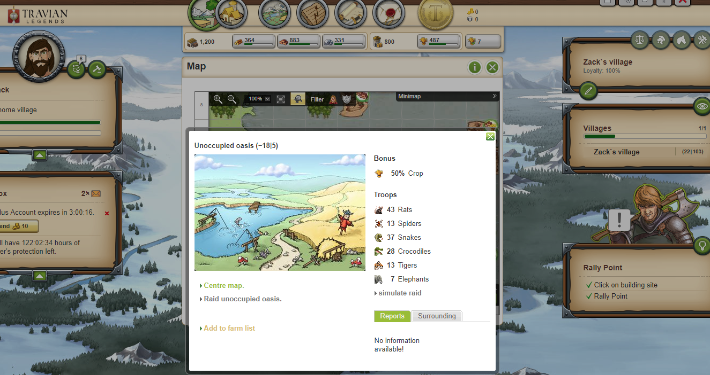

# Travian Elephants Finder

 

The tool for analysis oases (free or occupied) and searching animals (Elephant and etc).

Tested in **Shadow Empires**, **Fire and Sand** and **Legends (4)**.

 

## Setup

- clone the repo
- install the dependencies: `npm install`
- run `npm run setup`
- you should probably register new fake account for these manipulations.

## Config

Set correct configuration in:

- `.env` file
- `src/config/cookie.txt` file

### cookie

1. Open map, https://your-game-world.travian.com/karte.php

    

2. Open DevTools(F12 Chrome), Network tab’s, filter by XHR:

    

3. Select random request from list (F5 if it’s empty) and copy **cookie** from request:

   

4. Insert selected cookie value into `src/config/cookie.text` file

### MIN_X, MIN_Y

The Top Left Corner Co-Ordinate of the Map Area to be searched.

### MAX_X, MAX_Y

The Bottom Right Corner Co-Ordinate of the Map Area to be searched.

### START_X, START_Y

Position of search (your village or cap, probably), calculate distance (for sorting oases closest to you)

## Start

- `npm run clean` - command clean data directory and create files
- `npm run collect` - (collecting oases position) and wait… It will take a lot of time (depends on your config (MIN_X,
  MIN_Y, MAX_X, MAX_Y, DELAY_MIN, DELAY_MAX) etc)

- `npm run find` - find animals in oases

Result in CSV file: `output/elephant_*.csv`

|  x  |  y  | Elephant | Another animal | hasCrocodile | hasTiger | totalAnimal |
| :---: | :---: | :--------: | :--------------: | :------------: | :--------: | :-----------: |
| -18 |  5  | 7 | 6 | 1 | 1 | 141 |
| -14 |  3  | 4 | 5 | 0 | 0 | 34 |
| -42 |  14 | 3 | 4 | 0 | 0 | 77 |
| -48 |  -7 | 3 | 4 | 0 | 0 | 84 |

## Technologies

- **Node.js** >=20
- **Axios** — HTTP requests
- **Cheerio** — HTML parsing
- **cli-progress** — progress bar
- **dotenv** — environment config

## Author

* [**Mykhavko Ivan**](https://github.com/Tegos)

## License

This project is licensed under the MIT License - see the [LICENSE](LICENSE) file for details

## Disclaimer

_Please note that this is a research project, I am by no means responsible for any usage of this tool._  
_Use on your own behalf, I am also not responsible if your accounts get banned due to extensive use of this tool._

---

  

