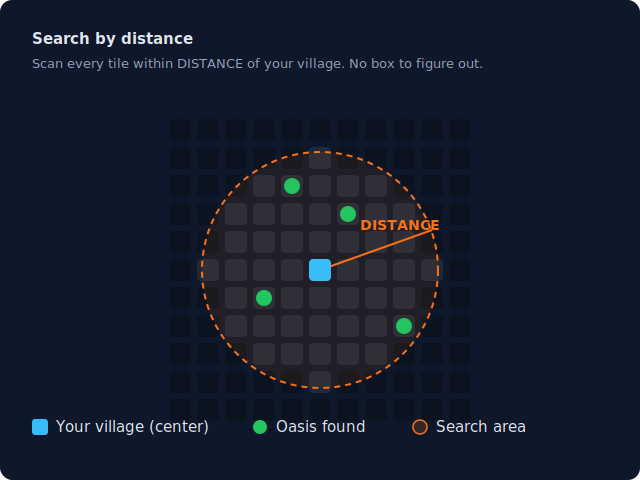
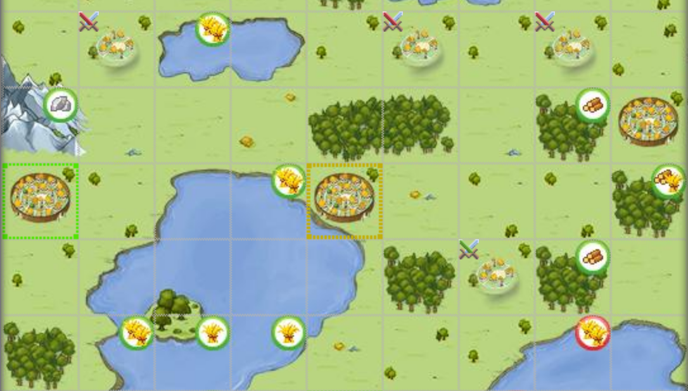
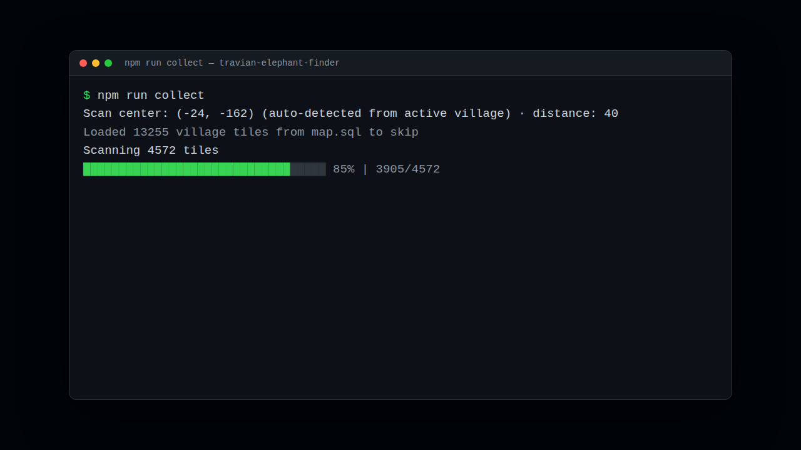
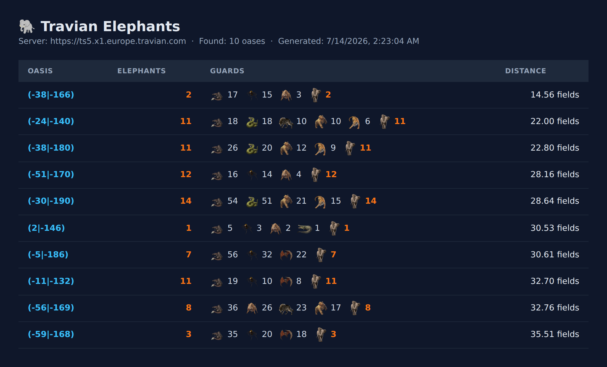

# Travian Elephant Finder

[](https://github.com/tegos/travian-elephant-finder/actions/workflows/ci.yml)
[](LICENSE)
[](package.json)

<br/>

**Find the best oases to raid near your village, automatically.**

In Travian, oases are map tiles guarded by wild animals. Clear one and you get a resource bonus plus hero experience. **Elephants** are the toughest guards and give the most hero XP, so oases with elephants are the best targets on the map. Finding them by hand means opening hundreds of tiles one by one.

This tool does it for you. Tell it how far around your village to look, and it scans every tile in that area, records each oasis, then checks which ones hold elephants (and crocodiles, tigers, and other animals). You get a tidy report sorted by distance, closest first.

Tested in **Shadow Empires**, **Fire and Sand** and **Legends (4)**.

<p align="center">
<br/>


</p>

## Table of contents

- [Why elephant oases?](#why-elephant-oases)
- [How the search works](#how-the-search-works)
- [Requirements](#requirements)
- [Quickstart](#quickstart)
- [Configuration](#configuration)
- [Usage](#usage)
- [Understanding the report](#understanding-the-report)
- [Troubleshooting](#troubleshooting)
- [Development](#development)
- [Technologies](#technologies)
- [Author](#author)
- [License](#license)
- [Disclaimer](#disclaimer)

## Why elephant oases?

Clearing an oasis is one of the strongest early plays in Travian, and elephants make it pay off the most in three ways:

- **Hero experience.** Your hero earns XP equal to each animal's crop upkeep. The elephant has the highest upkeep (`5`), so it gives the most XP per kill - an elephant oasis levels your hero fastest.
- **A permanent village bonus.** Once the guards are gone you can annex the oasis to a village within 3 tiles (via the Hero's Mansion) for a lasting production bonus (+25% / +50%, or extra crop).
- **The best free defenders on the map.** Attack an oasis with **Cages** equipped on your hero and you *capture* the animals instead of killing them. Captured animals are stationed in your hero's home village and defend it at zero crop upkeep. Cages take the weakest animals first and the elephant last, so an elephant is the top prize: `440` defense vs infantry, `520` vs cavalry, no food cost.

Note: **Cages** is a hero consumable item - not the Gaul **Trapper** building, which captures attacking *enemy troops*, not wild animals. Different systems, easy to mix up.

That is why this tool hunts elephant oases specifically: the most hero XP, and the strongest defenders you can add for free.

### Animal guard stats

What each oasis animal is worth - as a guard you fight, and as a defender if you cage it (Travian T4 / Legends standard-speed values):

| Animal | Attack | Def vs infantry | Def vs cavalry | Upkeep (= hero XP) |
|---|--:|--:|--:|--:|
| Rat | 10 | 25 | 10 | 1 |
| Spider | 20 | 35 | 40 | 1 |
| Snake | 60 | 40 | 60 | 1 |
| Bat | 80 | 66 | 50 | 1 |
| Wild Boar | 50 | 70 | 33 | 2 |
| Wolf | 100 | 80 | 70 | 2 |
| Bear | 250 | 140 | 200 | 3 |
| Tiger | 200 | 170 | 250 | 3 |
| Crocodile | 450 | 380 | 240 | 3 |
| Elephant | 600 | 440 | 520 | 5 |

Higher defense means a better caged defender; higher upkeep means more hero XP. The elephant tops both, with crocodile and tiger close behind - which is why the report counts elephants and shows the full guard list next to them.

## How the search works

You pick a **center** and a **distance**. The tool scans every map tile within that distance of the center - a circle around your village - and finds the oases inside it. That's the whole idea: one point, one number.



- **Center** - by default, your **active village**. Leave `START_X` / `START_Y` empty in the config and the tool reads your village coordinates from the game automatically. Want to search around a different spot (an alliance hub, a future settling area)? Just type those coordinates in.
- **Distance** - how far to look, in map tiles. `DISTANCE=15` means "scan everything within 15 tiles of the center". Bigger distance = more tiles = longer scan.

Before each scan the tool tells you how many tiles it will check and roughly how long that takes, so there are no surprises:

```text
Scan center: (-24, -162) (auto-detected from active village) · distance: 7
Scanning 131 tiles (~2 min at current delay)
```

Village tiles are skipped automatically (a village can never be an oasis), so the scan only spends time on tiles that might actually be one.



## Requirements

- Node.js >=22 (see `.nvmrc` - run `nvm use` if you have nvm)
- A Travian account (use a throwaway/fake one - see the [Disclaimer](#disclaimer))

## Quickstart

```bash
git clone https://github.com/tegos/travian-elephant-finder.git
cd travian-elephant-finder
npm install
npm run setup          # creates your .env config file
# open .env and fill in your server + login (see Configuration below)
npm run collect        # scan the area, record every oasis
npm run find           # check those oases for elephants, write the report
```

That's it. When `find` is done, open the generated HTML file in `output/` to see your targets.

## Configuration

`npm run setup` creates a `.env` file from the template. Open it and fill it in:

```dotenv
TRAVIAN_SERVER=https://ts5.x1.europe.travian.com
TRAVIAN_LOGIN=your-account-name
TRAVIAN_PASSWORD=your-password

# Center of the search. Leave both empty to use your active village automatically.
START_X=
START_Y=

# How far to search, in map tiles around the center.
DISTANCE=15

DELAY_MIN=100
DELAY_MAX=1500
```

| Setting | What it does |
|---|---|
| `TRAVIAN_SERVER` | Your game world's address, e.g. `https://ts5.x1.europe.travian.com` |
| `TRAVIAN_LOGIN` | Your account name (throwaway account recommended - see disclaimer) |
| `TRAVIAN_PASSWORD` | Your account password |
| `START_X`, `START_Y` | Center of the search. **Leave empty** to use your active village. Fill in only to search elsewhere. |
| `DISTANCE` | How far to search, in tiles. Default `15`. Start small, increase if you want a wider area. |
| `DELAY_MIN`, `DELAY_MAX` | Random pause between requests, in milliseconds. Keeps traffic looking human. |

The only settings you *must* fill in are the server and your login. Everything else has a sensible default.

> **Ban risk:** this tool logs into your Travian account through the game's own login API using the credentials in `.env`, then automates gameplay. That is against most servers' terms of service, and handing real credentials to a script is a direct violation. Use a throwaway account you're prepared to lose - never your main. The maintainer is not responsible for banned accounts.

> The tool manages its own login session (stored in `src/config/cookie.txt`) and refreshes it automatically. You never touch that file.

## Usage

**1. Scan the area** - `npm run collect` opens every tile within `DISTANCE` of your center and records which ones are oases.



**2. Find the elephants** - `npm run find` goes through the recorded oases, checks the animals guarding each, and writes the report.

**3. Read the report** - results land in `output/`:
- `elephant_*.html` - a sortable report, open it in your browser
- `elephant_*.csv` - the raw data, for spreadsheets

Need a fresh start? `npm run clean` empties the `output/` folder and resets the recorded oases. Run it before scanning a different area so old results don't mix in.

## Understanding the report

The HTML report lists every oasis that holds elephants. Each coordinate links straight to that tile on the in-game map, and you can click any column header to re-sort.



| Column | Meaning |
|---|---|
| `Oasis` | Oasis coordinates, linked to the tile on the in-game map |
| `Elephants` | How many elephants guard the oasis |
| `Guards` | The full guard list - every animal type and its count, with elephants highlighted |
| `Distance` | Distance from your scan center, in fields |

The `elephant_*.csv` alongside it holds the same data as plain columns (`x, y, distance, elephants, totalAnimals, guards`) for spreadsheets.

## Troubleshooting

- **Exits with "Missing required configuration"** - a required `.env` value is empty, usually `TRAVIAN_LOGIN` / `TRAVIAN_PASSWORD`. Re-check the [Configuration](#configuration) section.
- **Exits with "Login failed: ..."** - wrong credentials, or the account is locked/banned. Double-check your login and password.
- **"Could not auto-detect village coordinates"** - the tool couldn't read your village from the game. Fill in `START_X` and `START_Y` manually.
- **Scan is too slow** - lower `DISTANCE`, or raise `DELAY_MIN` / `DELAY_MAX` if you're being rate-limited. The tile count and time estimate printed at the start tell you what to expect.
- **Stalls or errors mid-run** - the session likely expired; the tool re-logs in automatically on the next request. If it keeps failing, just rerun: `find` picks up where it stopped and skips oases it already checked. `collect` re-scans from the start and appends, so run `npm run clean` first when restarting a collect to avoid duplicate entries.

## Development

- `npm test` - run the unit tests
- `npm run lint` - check code style with [Biome](https://biomejs.dev/)
- `npm run lint:fix` - auto-fix what Biome can

## Technologies

- **Node.js** >=22
- **Axios** - HTTP requests
- **Cheerio** - HTML parsing
- **cli-progress** - progress bar
- **dotenv** - environment config
- **Biome** - linting/formatting

## Author

* [**Mykhavko Ivan**](https://github.com/Tegos)

## License

This project is licensed under the MIT License - see the [LICENSE](LICENSE) file for details

## Disclaimer

_This is a research project - use it on your own behalf and at your own risk. The maintainer is not responsible for how it's used or for any consequences, including banned accounts._

---

<p align="center">
  <a href="https://savelife.in.ua/en/donate-en/" target="_blank">
    
  </a>
</p>
